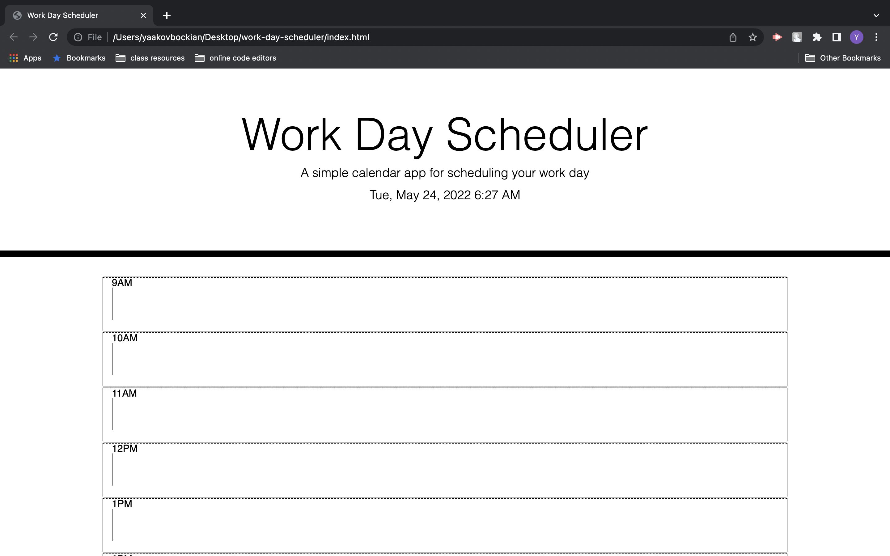
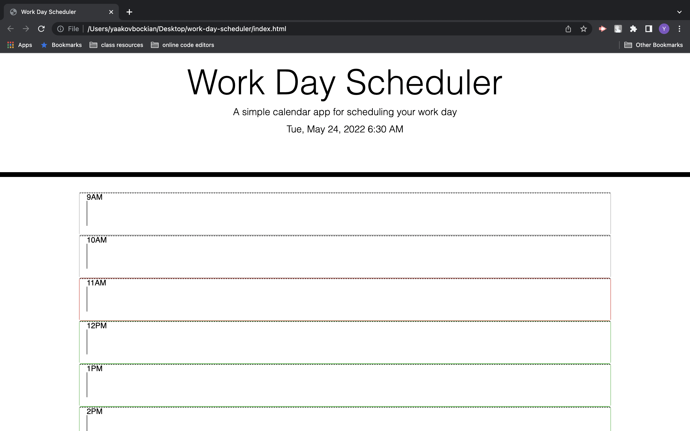

# Work Day Scheduler

## Description 
For this weeks homework assignment, I built a scheduling program.
When the the time is now, the color is red.
When the time was then, the color is gray
When the time is yet to come, the color is green.

## Screenshot

## Link
https://github.com/brudter/scheduler-project
https://brudter.github.io/scheduler-project/
